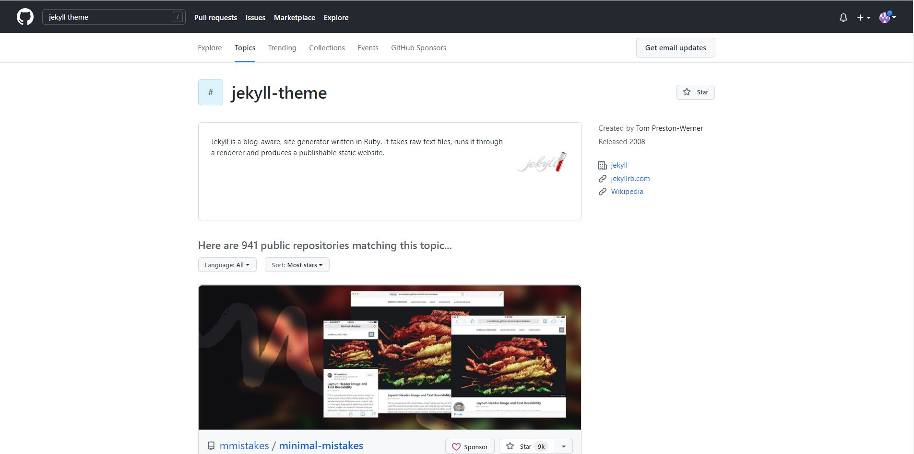
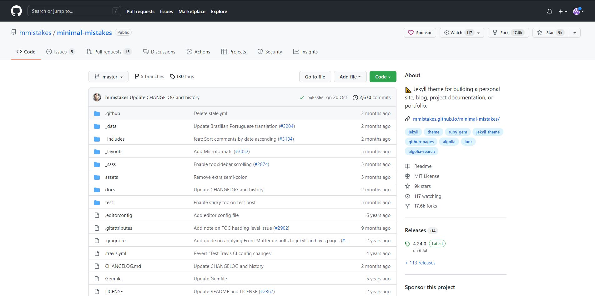
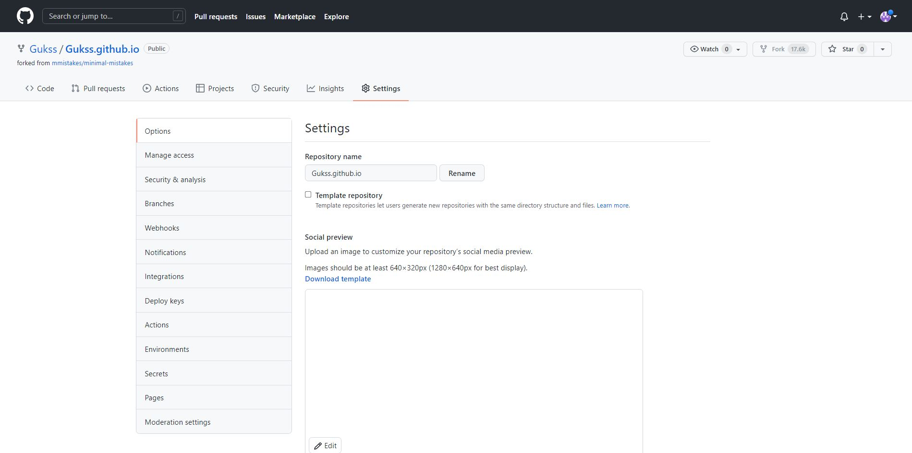
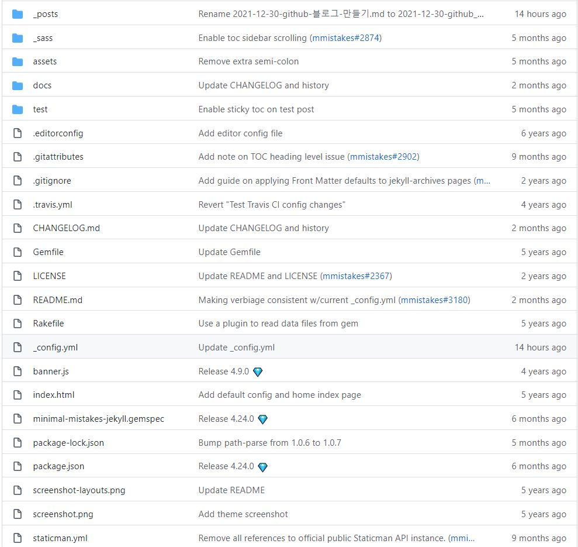
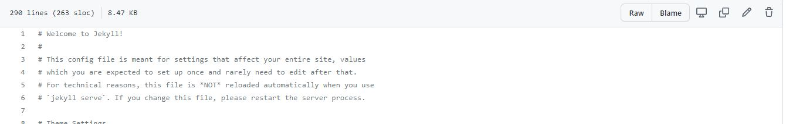
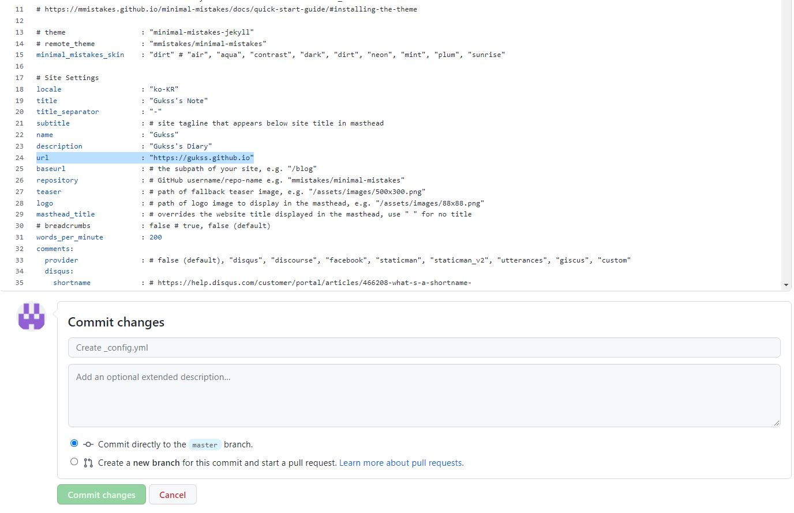

# github 블로그 생성

## 1. 마음에 드는 테마 Fork 하기
### a. 마음에 드는 테마를 찾는다.

[https://github.com/topics/jekyll-theme](https://github.com/topics/jekyll-theme)  
위 링크로 들어가 마음에 드는 테마를 찾는다.

### b. 마음에 드는 테마를 찾아 Fork 한다.

프로필 사진 아래에 있는 Fork 버튼을 누르면 본인의 계정에 모든 코드가 복사된다.

## 2. Repository name 을 "[본인 ID].github.io" 로 바꿔준다.

여기서 대, 소문자를 구분해 줘야 하는것 같았다.
이름을 바꾸고 Rename을 눌러 Repository 이름을 바꿔 준다.

## 3. 상단 바에서 Code를 눌러 코드창으로 돌아와 "_config.yml" 파일을 수정한다.

### a. _config.yml 파일을 클릭 후 오른쪽 위에 연필 버튼을 눌러 수정한다.

## 4. url을 찾아 "https://[본인 ID].github.io"로 수정해 준다.

수정 후 Commit Changes를 누른다.

## 브라우저에 수정한 url을 입력하면 블로그가 생성된 것을 확인 할 수 있다.
