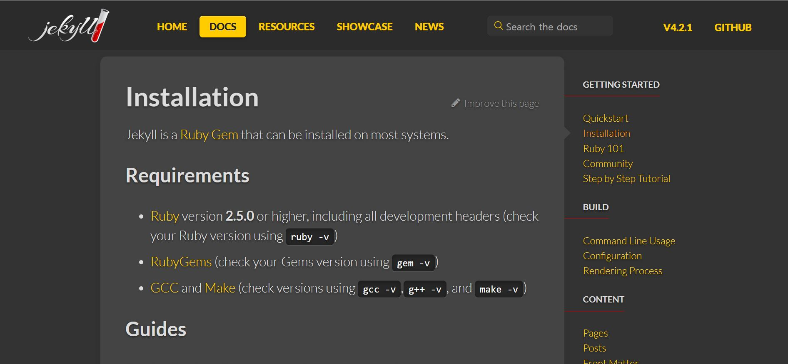
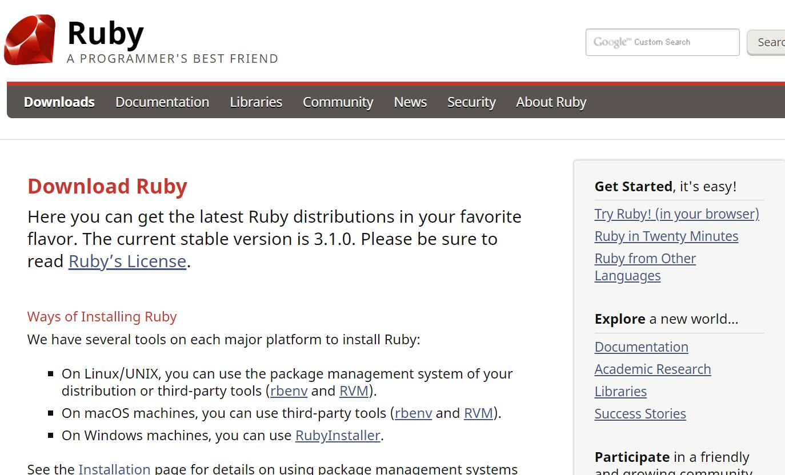
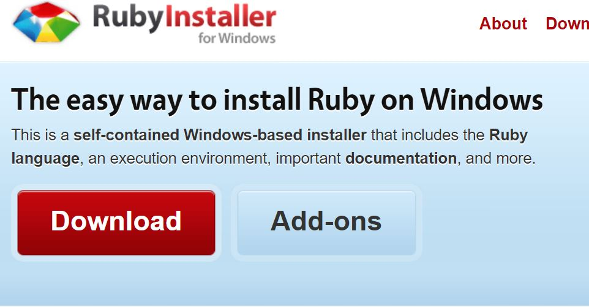
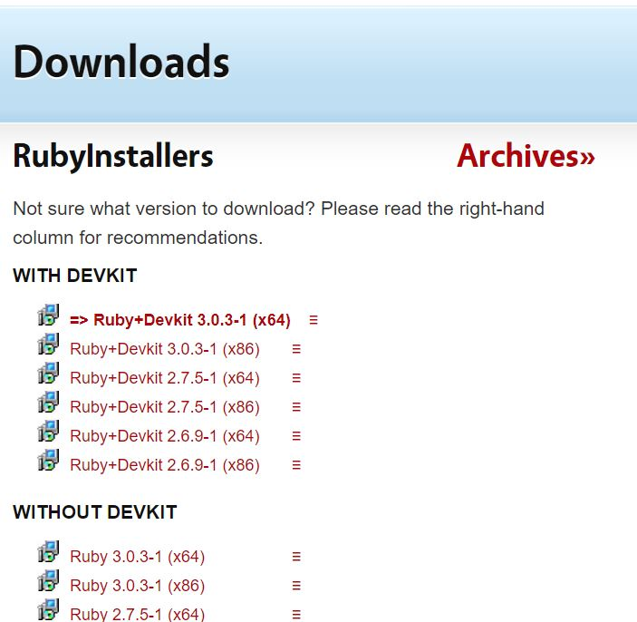
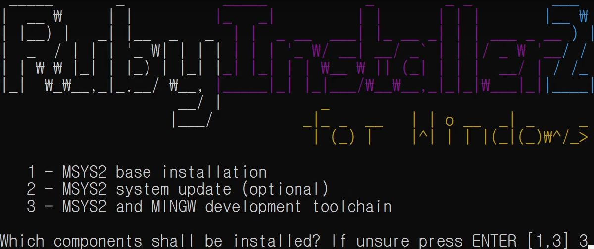
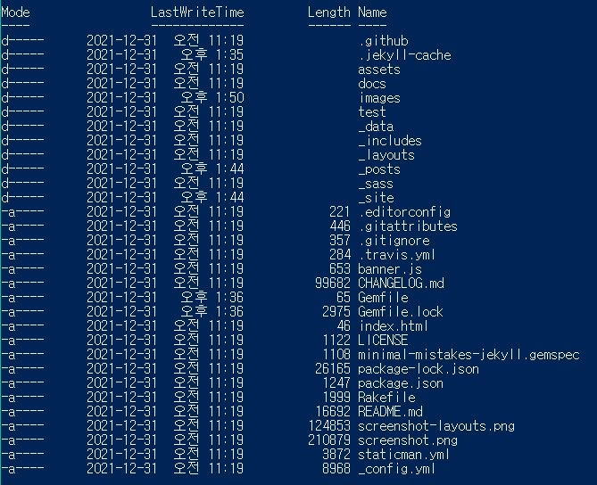

# local 에서 변경사항 바로 확인하기

## 1. 요구사항 중 Ruby를 먼저 설치

<https://jekyllrb.com/docs/installation>  
위 링크로 들어가 Requirements의 Ruby를 클릭하면 설치 페이지로 이동

## 2. 운영체제에 맞게 설치

윈도우는 세 번째

## 3. 버전 선택

다운로드 버튼을 클릭후


DEVKIT의 제일 상단 버전 다운로드  
체크박스 기본 설정에서 변경사항 없이 설치

## 4. Ruby 설치

1~3 번 중 3번 누르고 enter입력해 설치 시작

## 5. 실행창
1. 실행창 (cmd)실행한 후 ```gem install jekyll``` 입력 -> 설치된다.  
2. 실행창에 ```gem install bundler``` 입력 -> 설치된다.
    
3. 블로그 프로젝트가 있는 폴더에서 cmd 창을 열어 ```bunlde install``` 실행
4. 현재 폴더에서 ```bundle add webrick``` 입력 후
5. ```bundle exec jekyll server``` 입력하면 "http://127.0.0.1:4000" 4000번 포트에서 서버가 열린다.

## local 환경에서 저장만 하면 실시간으로 반영된다. 블로그 페이지를 완성하고 github에 push하면 된다.
